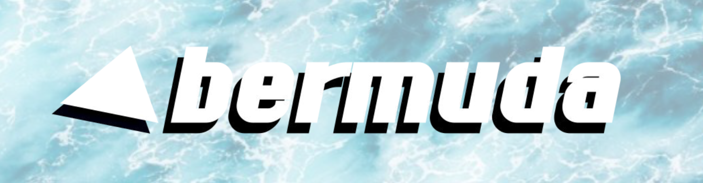

## Vision

Becoming the go-to privacy provider in EVM ecosystems and future fintech.

## Mission

Our long‑term mission is to make privacy:

- **Normal**: Every wallet user has access to private low-risk DeFi
- **Compliant**: Privacy systems can satisfy regulators with optional compliance proofs without leaking identity (e.g. POI, viewing keys, zkKYC)
- **Composable**: Dapps and middleware can integrate seamlessly
- **Neutral**: Bermuda is not a wallet, not a chain, not a custodian, but an open infra layer

## Architecture

We are building a modular privacy layer adaptable to different use cases. At its core is our shielded hyperpool. "Hyper" because it isn't just an isolated privacy pool but rather a full-blown privacy layer providing essential functions such as P2P transactions and swaps by itself in addition to seamless access to Ethereum's most popular dapps through shielding adapters.

From a bird's view Bermuda can be seen as an universal privacy layer that sits in between wallets and dapps.

Core components of Bermuda comprise its smart contracts, i.e. the hyperpool, ZK-proof verifiers, adapters (ERC-4626, DEXs, Safe, etc.), the only core off-chain component is the prover stack.

To facilitate absolute self-custody our proving stack is all client-side, the only exception being ZK storage proofs that are for now, development and testnet purposes, being run on servers. We are actively working on efficient and portable client-side proving of ZK MPT proofs.

We consider portable, i.e. efficient on low-grade consumer hardware, client-side ZK proving, especially of MPT proofs, a cornerstone for self-custodial privacy applications, because client-side ZK MPT proofs enable private proving of almost anything on Ethereum.

## Integrations

Current design partners include major wallets and ecosystems that we are exploring privacy use cases with:

- Native wallet integrations
  - Shielded balances, transactions, staking, and swaps
- Shielded ERC-4626 vaults
- Shielded crypto debit card payments
- Smart account support for all of the above

Beyond that we are in talks with payment providers as well as asset managers and are actively looking for further partners to shape our product(s) with.

UX is a major focus for us and we want to see privacy features seamlessly integrated into wallets, just like Vitalik does:

To that end we have built a MetaMask Snap featuring shielded P2P transfers and swaps. Soon to be realeased.

Another major integration is our current work on a native Safe web wallet integration, i.e. a fork with minimal adaptions to enable shielded P2P transactions (and more) for any Safe.

## Roadmap

### V1 (WIP)

- Major wallet integrations
- Shielded crypto debit cards
- Fully shielded swaps
- DeFi adapters
  - Shielding DEX adapters
  - Shielding ERC-4626 vault adapters
- Smart account support

### V2

- Shielded x402
- Shielded retail checkouts
- Shielding stack for asset managers
- Shielded on-off-ramps and remittances

## Ecosystem Partners

Gnosis helped us bootstrap Bermuda and we are deeply aligned with Ethereum's values in general and the EF's privacy roadmap in particular as we have been focusing on cornerstones such as wallet integrations and smart account support. We would love to align even more with ecosystem partners, collaborate on intersecting subject matters and attain synergies.
