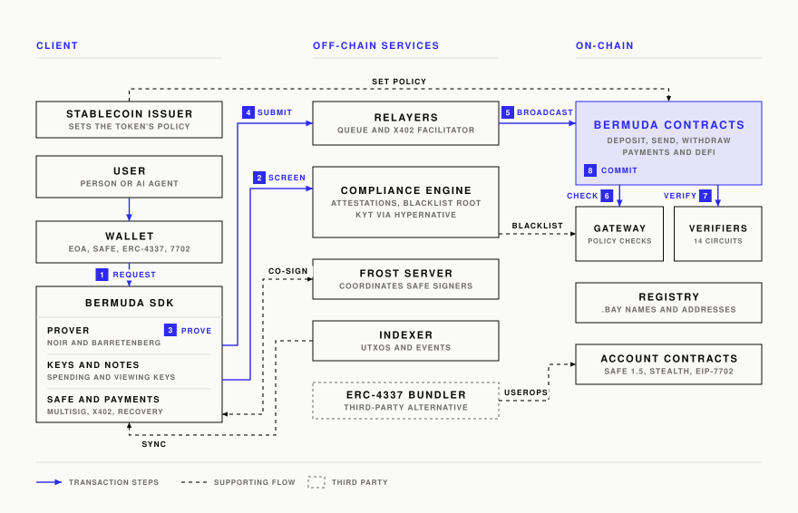
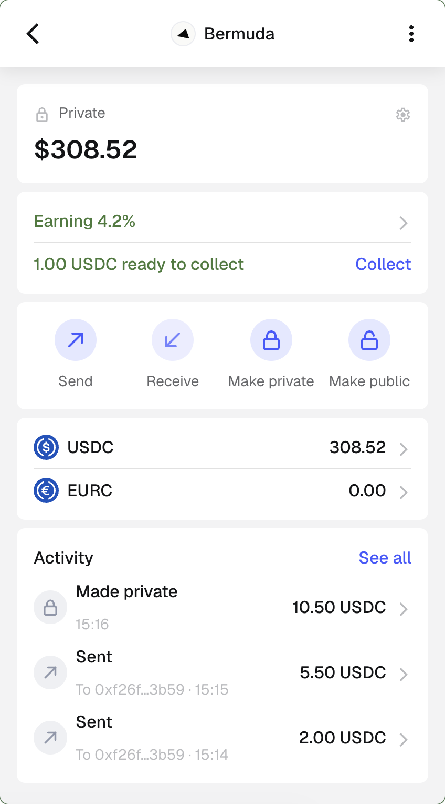
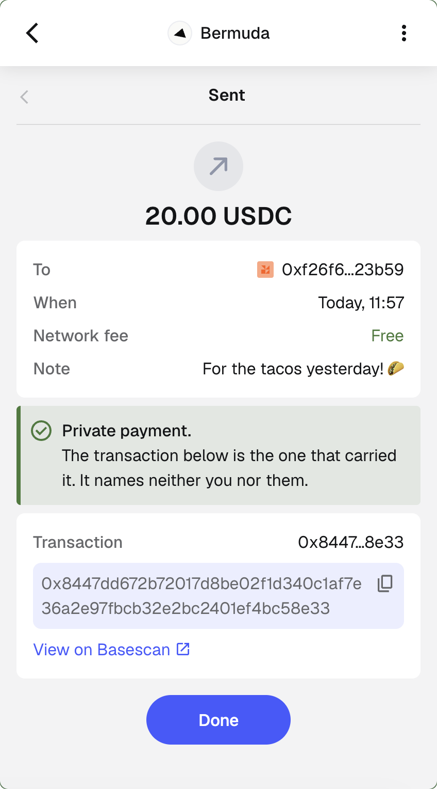
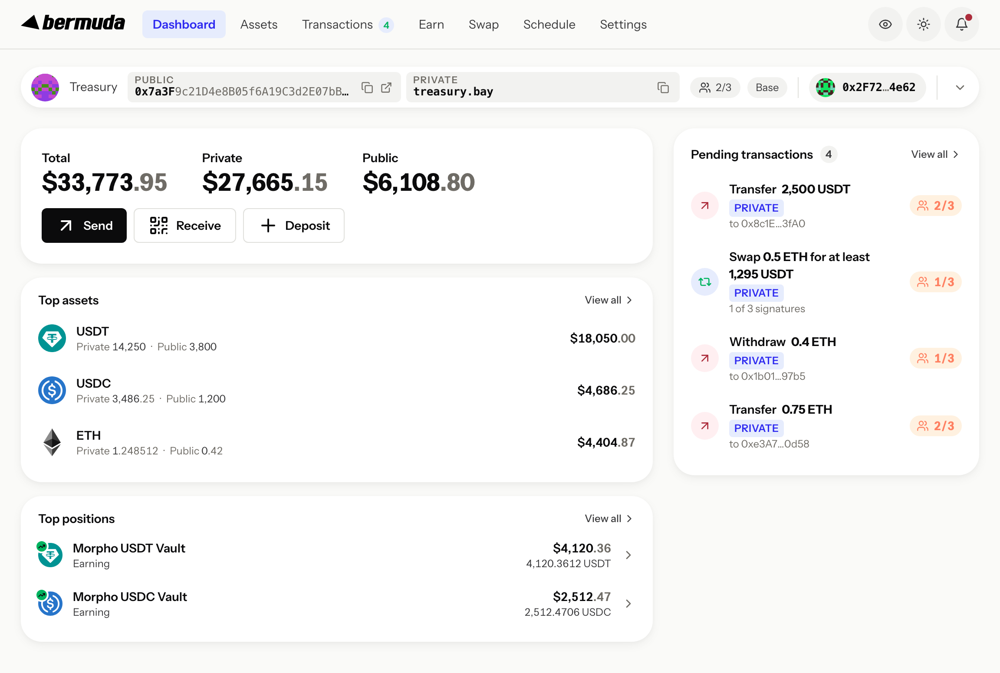

<p align="center">
  <picture>
    <source media="(prefers-color-scheme: dark)" srcset="./logo-white.svg">
    
  </picture>
</p>

<h3 align="center">Private rails for onchain assets.</h3>

<p align="center">
  Compliant privacy for regulated money on public chains.<br>
  The issuer's policy runs inside every private transfer.
</p>

<p align="center">
  <a href="https://bermudabay.xyz">Website</a> ·
  <a href="https://docs.bermudabay.xyz">Docs</a> ·
  <a href="https://x.com/bermudabayzk">X</a> ·
  <a href="https://calendly.com/bermudabayxyz">Talk to us</a>
</p>

---

## Why Bermuda

Every onchain payment is public. Anyone can read your balance, who you pay and your next trade. Forever.

Bermuda is a drop-in privacy and compliance layer for wallets, institutions and any EVM app. Balances, counterparties and amounts stay confidential, while every transfer is screened against the issuer's policy. No contract changes, no new chain, no wrapped tokens.

## How it works

1. **Shield**: native tokens go in (USDC, EURC, tokenized funds). No wrapping, no new chain.
2. **Enforce**: sanctions, limits and allow lists run inside every private transfer.
3. **Control**: issuers keep per-user powers (freeze, clawback and a viewing key), private to everyone else.

Compliance is built in, not bolted on:

- **Screened at the door**: funds are checked against issuer policy before they enter.
- **Enforced on every transfer**: the issuer's rules run inside each private transfer.
- **Provenance travels with the asset**: no central database.
- **Selective disclosure**: auditors see what they are entitled to, nothing more.

## Architecture

<p align="center">
  <picture>
    <source media="(prefers-color-scheme: dark)" srcset="./architecture-dark.svg">
    
  </picture>
</p>

A transaction runs in eight steps: **request → screen → prove → submit → broadcast → check → verify → commit**.

- **Client**: the Bermuda SDK holds spending and viewing keys and generates the ZK proofs (Noir and Barretenberg). It also covers Safe multisigs, x402 and recovery. Works with EOAs, Safe, ERC-4337 and EIP-7702 wallets.
- **Off-chain services**: relayers submit and broadcast transactions and double as the x402 facilitator. The compliance engine screens funds and issues attestations, a FROST server coordinates Safe signers, and an indexer syncs UTXOs and events.
- **On-chain**: the Bermuda contracts handle deposits, sends, withdrawals, payments and DeFi. The gateway runs the issuer's policy checks and the verifiers check every proof. The registry maps `.bay` names to addresses, and account contracts support Safe 1.5, stealth accounts and EIP-7702.

## Built for

| Who | What Bermuda adds |
|---|---|
| **Wallets & neobanks** | A private account inside the wallet. Every issuer's assets, one integration. |
| **Custodians** | Confidential custody and settlement. |
| **Banks** | On-prem, in the bank's own stack. |
| **Issuers** | Rules set once, enforced everywhere. |
| **Institutions** | Atomic DvP, PvP and DvD settlement, repo and OTC, account recovery and confidential DeFi. |
| **AI agents** | Private [x402](https://docs.bermudabay.xyz/sdk/x402) payments: payer, payee, amount and frequency stay hidden. |

## Products

### MetaMask Snap

A private account right inside MetaMask. Make funds private or public with one tap, send privately without paying gas, and earn yield on your private balance.

<p align="center">
  
  &nbsp;&nbsp;&nbsp;
  
</p>

### Private Safe

A Safe{Wallet}-style dashboard for Safes whose funds live in Bermuda's shielded pool. Balances, recipients and amounts stay private. Spend authority is a FROST threshold signature across the Safe's owners, so no single owner ever holds the spending key. Treasuries see private and public balances side by side and can send, swap and earn privately.

<p align="center">
  <picture>
    <source media="(prefers-color-scheme: dark)" srcset="./safe-dashboard-dark.png">
    
  </picture>
</p>

### Wallet Development Kit

[`wdk-wallet-bermuda`](https://github.com/BermudaBay/wdk-wallet-bermuda) brings Bermuda accounts to wallets built on Tether's WDK.

## For builders

One SDK. Ship privacy in days.

```ts
import { init } from '@bermuda/sdk'

const sdk = init('base')

// bermuda account
const account = await sdk.account({ signer })

// private, gasless transfer
const tx = await sdk.transfer({
  spender: account,
  token: sdk.config.USDC,
  amount: 1_000_000_000n,
  to: recipient,
})
await sdk.relay(tx)
```

Read the [quickstart](https://docs.bermudabay.xyz/sdk/quickstart) to get going.

## Get in touch

We are integrating with wallets, custodians, banks and issuers now. [Talk to us](https://calendly.com/bermudabayxyz) or write to [gm@bermudabay.xyz](mailto:gm@bermudabay.xyz).
